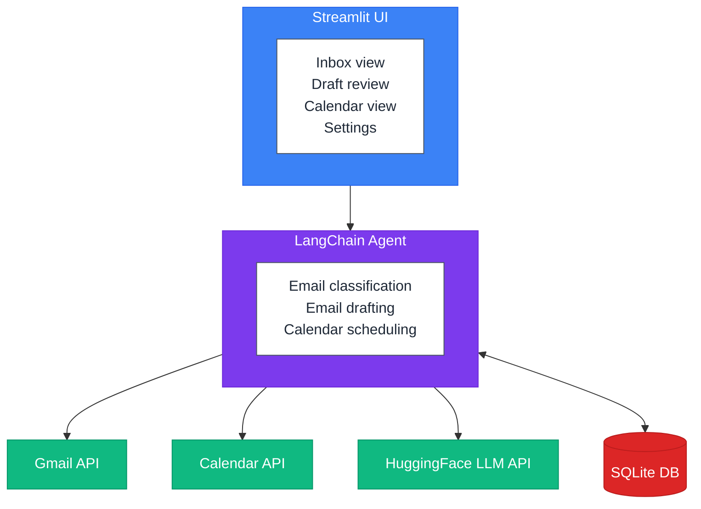

# Gmail Agent

[](https://github.com/PierreExeter/gmail-agent/actions/workflows/ci.yml)
[](https://github.com/PierreExeter/gmail-agent/actions/workflows/docs.yml)
[](https://www.python.org/downloads/)
[](https://opensource.org/licenses/MIT)

An AI-powered email and calendar assistant that helps you manage your Gmail inbox and Google Calendar. Built with Streamlit, LangChain, and HuggingFace LLMs.

 

## Features

- **Smart Email Classification** - Automatically categorizes emails as needing reply, FYI only, meeting requests, or action items
- **AI-Powered Draft Replies** - Generates contextual reply drafts with customizable tone
- **Meeting Scheduling** - Extracts meeting details from emails and finds available calendar slots
- **Human-in-the-Loop Approval** - Flags sensitive emails and low-confidence classifications for manual review
- **Trusted Sender Management** - Build a list of known senders to streamline approval workflows

## Architecture



## Prerequisites

- Python 3.11 or higher
- [uv](https://docs.astral.sh/uv/) package manager
- Google Cloud account with Gmail and Calendar APIs enabled
- HuggingFace account with API access

## Installation

1. **Clone the repository**
   ```bash
   git clone https://github.com/PierreExeter/gmail-agent.git
   cd gmail-agent
   ```

2. **Install dependencies**
   ```bash
   uv sync
   ```

3. **Set up environment variables**
   ```bash
   cp .env.example .env
   ```

   Edit `.env` with your credentials:
   ```
   HUGGINGFACE_API_KEY=hf_your_api_key
   GOOGLE_CLIENT_ID=your_client_id.apps.googleusercontent.com
   GOOGLE_CLIENT_SECRET=your_client_secret
   ```

## Google Cloud Setup

1. Go to [Google Cloud Console](https://console.cloud.google.com/)
2. Create a new project
3. Enable **Gmail API** and **Google Calendar API**
4. Configure the OAuth consent screen (External, add yourself as test user)
5. Create OAuth 2.0 credentials (Desktop app type)
6. Copy the Client ID and Client Secret to your `.env` file

## HuggingFace Setup

1. Go to [HuggingFace Settings](https://huggingface.co/settings/tokens)
2. Create a new access token with **Read** permissions
3. Copy the token to your `.env` file

## Usage

Start the application:

```bash
uv run streamlit run app.py
```

The app will open in your browser at `http://localhost:8501`.

### First Run

1. Navigate to **Settings** and click "Connect Google Account"
2. Complete the OAuth flow in the browser popup
3. Return to the **Inbox** to start processing emails

### Workflow

1. **Inbox** - View and classify emails. Click "Classify" to analyze an email, then "Draft Reply" to generate a response.
2. **Drafts** - Review, edit, and approve AI-generated replies before sending.
3. **Calendar** - View upcoming events and manage meeting requests extracted from emails.
4. **Settings** - Configure API keys, LLM model, confidence thresholds, and trusted senders.

## Configuration

| Variable | Description | Default |
|----------|-------------|---------|
| `HUGGINGFACE_API_KEY` | HuggingFace API token | Required |
| `GOOGLE_CLIENT_ID` | Google OAuth client ID | Required |
| `GOOGLE_CLIENT_SECRET` | Google OAuth client secret | Required |
| `LLM_MODEL_ID` | HuggingFace model for inference | `meta-llama/Llama-3.1-8B-Instruct` |
| `CONFIDENCE_THRESHOLD` | Minimum confidence for auto-approval | `0.7` |

## Project Structure

```
gmail_agent/
├── app.py                 # Streamlit entry point
├── config.py              # Configuration and environment variables
├── mkdocs.yml             # Documentation configuration
├── auth/                  # Google OAuth authentication
├── services/              # Gmail, Calendar, and LLM API wrappers
├── agent/                 # AI agents (classifier, drafter, scheduler)
├── db/                    # SQLAlchemy models and database operations
├── ui/                    # Streamlit UI components
├── docs/                  # User documentation (MkDocs)
└── tests/                 # Test suite
```

## Development

### Running Tests

```bash
uv run pytest
```

### Code Quality

```bash
# Linting
uv run ruff check .

# Formatting
uv run ruff format .

# Type checking
uv run pyright
```

## Documentation

Full documentation is available at [pierreexeter.github.io/gmail-agent](https://pierreexeter.github.io/gmail-agent/).

```bash
# Local preview (live-reload dev server)
uv run mkdocs serve

# Build static site locally
uv run mkdocs build

# Deploy to GitHub Pages
uv run mkdocs gh-deploy --force
```

## Security Notes

- Never commit `.env`, `data/token.json`, or `data/credentials.json`
- The `.gitignore` should exclude all sensitive files
- OAuth tokens are stored locally in `data/token.json`
- All email actions require explicit user approval

## License

MIT

## Contributing

Contributions are welcome! Please open an issue or submit a pull request.
