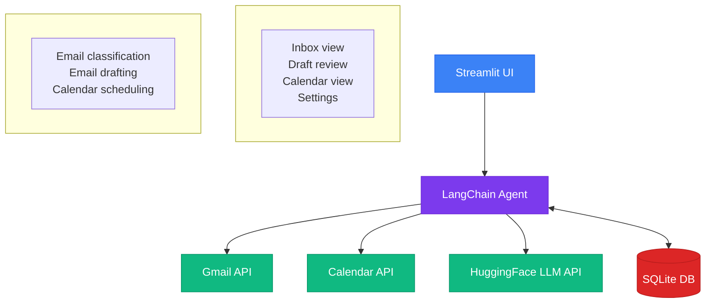

# Gmail Agent

Welcome to the Gmail Agent documentation. Gmail Agent is an AI-powered email and calendar assistant that helps you manage your Gmail inbox and Google Calendar.

## Overview

Gmail Agent uses LangChain and HuggingFace LLMs to intelligently process your emails, generate reply drafts, and manage calendar events with human oversight at every step.

## Key Features

- **Smart Email Classification** - Automatically categorizes emails as needing reply, FYI only, meeting requests, or action items
- **AI-Powered Draft Replies** - Generates contextual reply drafts with customizable tone
- **Meeting Scheduling** - Extracts meeting details from emails and finds available calendar slots
- **Human-in-the-Loop Approval** - Flags sensitive emails and low-confidence classifications for manual review
- **Trusted Sender Management** - Build a list of known senders to streamline approval workflows

## Architecture



## Quick Links

| Section | Description |
|---------|-------------|
| [Installation](getting-started/installation.md) | Get started with prerequisites and setup |
| [Google Setup](getting-started/google-setup.md) | Configure Google Cloud credentials |
| [HuggingFace Setup](getting-started/huggingface-setup.md) | Set up your HuggingFace API token |
| [First Run](getting-started/first-run.md) | Launch and connect your account |
| [Features](features/inbox.md) | Explore all application features |
| [Configuration](configuration/reference.md) | Environment variables and settings |
| [FAQ](troubleshooting/faq.md) | Common issues and solutions |

## Project Structure

```
gmail_agent/
├── app.py                 # Streamlit entry point
├── config.py              # Configuration and environment variables
├── auth/                  # Google OAuth authentication
├── services/              # Gmail, Calendar, and LLM API wrappers
├── agent/                 # AI agents (classifier, drafter, scheduler)
├── db/                    # SQLAlchemy models and database operations
├── ui/                    # Streamlit UI components
└── tests/                 # Test suite
```

## Security First

Gmail Agent is designed with security in mind:

- All email actions require explicit user approval
- Sensitive content is flagged automatically
- OAuth tokens are stored locally and never shared
- Unknown senders trigger additional review
